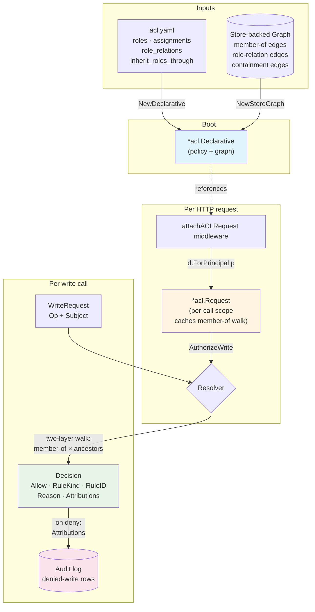
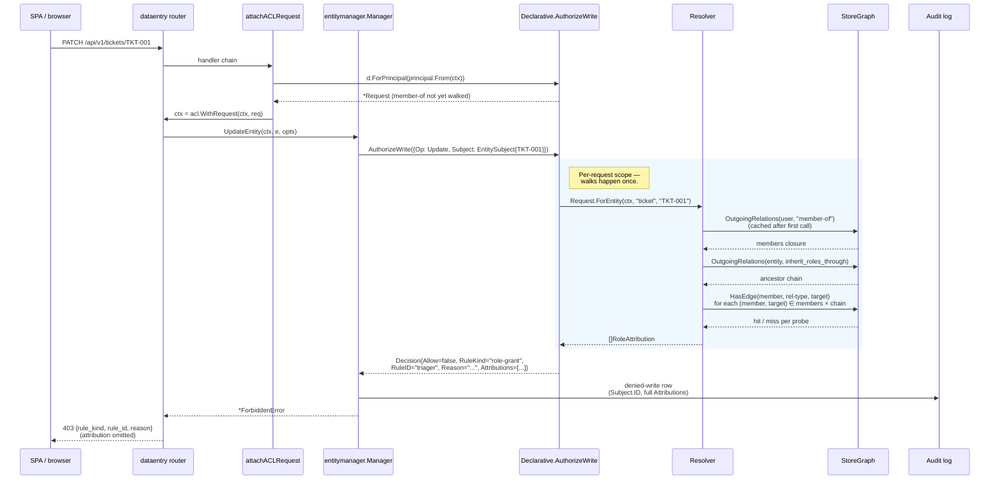
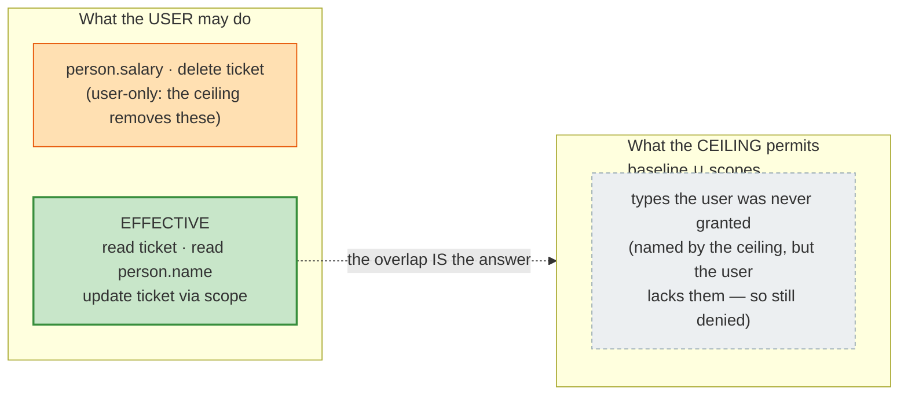

This guide walks through rela's authorization system end-to-end: how
an `acl.yaml` policy plus the graph's `member-of` and
`inherit_roles_through` edges become a per-write Allow/Deny decision
with full role-attribution provenance. Read [CON-authorization]
first for the vocabulary.

## How it fits together

The ACL system is one moving part: a `*acl.Declarative` constructed
from the policy plus a store-backed graph. Every write call moves
through it.



## Write sequence

A single PATCH from the SPA to the data-entry server traces through
the stack like this:



The single `Request` is what makes the per-list response viable: a
list of 50 tickets reuses one member-of walk and one ancestor chain
per ticket, instead of re-walking 50× from scratch.

## A worked acl.yaml

A small example that exercises every layer of the resolver:

```yaml
description: >          # optional prose: what this deployment's access model is for
  Access model for the ticket tracker. Editors own the backlog; readers and
  the everyone role get scoped read access.

roles:
  everyone:
    read: ["*"]
  reader:
    description: Read-only observer of tickets and features.   # optional prose
    read: [ticket, feature]
  editor:
    description: Backlog maintainer — full CRUD on tickets.     # optional prose
    read: [ticket, feature]
    create: [ticket]
    update: [ticket]
    delete: [ticket]
  triager:
    read: [ticket]
    fields:
      ticket:
        - field: status
          when: "true"

assignments:
  alice: editor              # global grant
  triage-team: triager       # group grant; principals member-of triage-team inherit

role_relations:
  editor-of:                 # an edge of this type confers a role
    confers: editor

inherit_roles_through:
  - belongs-to               # walk these ancestry edges when resolving local roles

# membership_relation: member-of   # optional; the relation walked for group
#                                  # membership. Default "member-of". Set it to
#                                  # a domain relation you already model
#                                  # (e.g. heeft_rol) to avoid a parallel edge
#                                  # system. If you do, gate writes to it the
#                                  # same way (see GUIDE-acl-security).
```

The top-level `description:` and the per-role `description:` are optional
documentation prose. They never affect an authorization decision — the resolver
ignores them entirely — and exist so tooling (the `rela docs` generator) can
narrate the role model in operator-facing documentation. Omitting them changes
nothing.

`membership_relation:` is optional. When omitted (or blank) the resolver walks
`member-of`, so existing policies are unaffected. Only set it to a relation type
your metamodel **actually defines** and uses for membership (e.g. `heeft_rol`):
the resolver walks exactly that relation, so if you name a type that doesn't
exist — or one your data doesn't populate — the walk finds no edges and group
roles silently never resolve. There's no separate "is this a real relation"
check; the relation simply has to be there.

## Granting relation writes without entity-create

A relation write is gated on the verb grant for the **source entity's type**.
`alice --spawnt--> TAAK-1` is a *create* checked against `terugkerend` — so the
only way to let a principal add that edge used to be granting it
`create: [terugkerend]`, i.e. authority to create `terugkerend` entities it was
never meant to have.

`relation_grants:` names a permission per relation type instead:

```yaml
relation_grants:
  spawnt:
    create: create-spawnt
    update: edit-spawnt
    delete: remove-spawnt

roles:
  scheduler-system:
    read: ["*"]
    create: [taak]          # entities it may create
    update: [taak, terugkerend]
    permissions: [create-spawnt]   # edges it may add
```

The scheduler can now write `spawnt` edges and still cannot create
`terugkerend` entities.

A shorthand covers all three verbs:

```yaml
relation_grants:
  spawnt:
    permission: manage-spawnt
```

The shorthand and the per-verb keys are mutually exclusive — a policy setting
both is rejected at load, with the expansion spelled out so you can paste it in
and change the one verb you meant.

### It only ever widens one thing

A `relation_grants:` permission is an **alternative satisfier of the source-type
verb grant**, never a bypass. The full decision is a conjunction:

```text
allow = (delegate-X satisfied, or not configured)
      AND the client ceiling permits the verb
      AND (a role grants the verb on the source type OR this block does)
```

So it cannot let a client escape a `client_baselines:` ceiling, and it cannot
satisfy a `requires_permission:` delegate gate. It is also inert when the source
entity's type cannot be resolved (a missing or unreadable source): an
unresolvable source stays a denial rather than becoming a free pass.

### Role-conferring relation types are refused

Creating some edges *grants roles*, so a permission to write them is a
permission to promote yourself. The policy refuses to load if
`relation_grants:` names one of:

- the membership relation (`member-of`, or whatever `membership_relation:` says)
  — group roles come from walking it;
- anything in `inherit_roles_through:` — local roles are conferred across it;
- a `role_relations:` entry with `requires_permission:` — that gate is the
  tamper-resistance, and a second rule about the same type only obscures which
  one applies.

Grant the entity-type verb for those, so the existing delegate-X hardening still
does its job.

### There is no `read:`

Relation visibility is *derived*: a relation is visible exactly when **both** its
endpoints are. An independent read grant would let someone see that an edge
exists — and therefore that an entity they cannot read exists. `read:` is
rejected at load. To hide edges, hide an endpoint.

### Cascade delete needs the relation grants too

Deleting an entity with `cascade` destroys its incident edges, so the principal
must be allowed to delete each of them — otherwise deleting an entity would be a
back door to removing edge types you hold no `delete` grant on.

A single denial fails the **whole** delete; nothing is written:

```console
$ rela delete REQ-1 --cascade
cannot delete REQ-1: its incoming addresses relation from DEC-1:
forbidden: no role grants delete on relations from type "decision"
```

Two consequences worth knowing:

- An entity delete can now fail on a *relation* grant. If a cascade that used to
  work starts failing, the fix is a `delete:` grant (or a `relation_grants:`
  entry) for the relation type named in the error — not a broader entity grant.
- Each relation is checked against **its own source type**, the same subject you
  would face deleting that edge directly. An incoming edge is therefore checked
  against the type at the *other* end, not against the entity being deleted.

The check runs inside the store transaction that performs the delete, so an edge
created concurrently cannot slip past it.

### Checking it

Ask the gate directly:

```console
$ rela acl can-relation system:scheduler create spawnt --from TERUG-1
ALLOW: system:scheduler can create a spawnt edge from TERUG-1 (terugkerend).
      via relation_grants — permission "create-spawnt"
```

A deny names the gate that refused and quotes its reason, which matters because
each one needs a different fix:

```console
$ rela acl can-relation system:scheduler create spawnt --from TERUG-1
DENY: system:scheduler cannot create a spawnt edge from TERUG-1 (terugkerend).
      no role grants create on relations from type "terugkerend"
      (rule_kind=role-grant rule_id=-)
```

| `rule_kind` | What refused | Fix |
| --- | --- | --- |
| `delegate-permission` | the `requires_permission` gate on a role-relation | grant that permission |
| `client-ceiling` | a `client_baselines:` attenuation | widen the baseline, or use a scope |
| `role-grant` | no source-type verb grant, and no relation permission held | grant the permission named in the reason |

It exits non-zero on deny, so it works as a CI gate. There is no `read` verb —
relation visibility is derived from both endpoints.

`relation_grants:` names permissions but does not grant them, so a block no role
backs is **inert**: writes silently fall back to the source-type verb grant.
`rela acl audit` reports that as `A6b-inert-relation-grant`.

One caveat when upgrading: an older binary does not know the `relation_grants:`
key and warn-and-ignores it. `rela acl can-relation` is the reliable check that
the grants are actually being enforced by the binary you are running.

## Resolving the principal to a user entity

By default `principal.User` is whatever the entry point stamped — for the
data-entry server that is the reverse-proxy header value verbatim (e.g.
`X-Forwarded-User: jvloothuis@sourcehaven.nl`). Assignments and membership
walks then match on that raw string, which forces operators to either
duplicate every human's identity in `acl.yaml` or rewrite headers in the
proxy.

When your graph already models people as entities (an ISMS `persoon`, a
`user` type), set two coupled keys so the resolver consults the graph
instead:

```yaml
user_entity_type: persoon
principal_property: email      # persoon.email holds the header value
membership_relation: heeft_rol
assignments:
  ROLE-MD: md
```

At the start of each request the resolver looks the raw principal up
against `persoon.email`. On **exactly one** match it substitutes that
entity's ID for `principal.User` for the rest of the request, so
membership and local-role walks operate from a real entity:

```text
Header (jvloothuis@sourcehaven.nl)
   └─ property lookup on persoon.email ─▶ PERS-JV
         └─ walkMembers via heeft_rol ─▶ ROLE-MD ─▶ role md
```

Rules and fallbacks:

- **Both keys required.** With `principal_property` unset, behaviour is
  byte-for-byte identical to before — the raw string is used as-is.
- **`principal_property` must be `unique: true`** on `user_entity_type`
  in the metamodel (enforced at boot). A non-unique key admits duplicates,
  which makes resolution ambiguous. See GUIDE-acl-security for how the
  uniqueness constraint is enforced on writes.
- **No match** keeps the raw principal — so an assignment keyed on the raw
  UPN (`assignments: { jvloothuis@sourcehaven.nl: md }`) still works as a
  break-glass escape hatch for identities not yet in the graph.
- **Multiple matches** (a data-integrity failure) keeps the raw principal
  and logs a warning; the resolver refuses to guess which entity is meant.
- **Lookup errors** keep the raw principal (fail-open to pre-feature
  behaviour) so a transient store hiccup never locks everyone out.

The audit log records both identities: `user` is the resolved entity ID
and `raw_user` is the original header value, so an operator can trace what
authenticated and what it resolved to without a graph round-trip.

For large user-entity sets, push the property equality into a backend
index — see GUIDE-acl-security.

## Roles from a verified identity assertion

When rela runs behind an OIDC identity proxy that signs an identity
assertion (see GUIDE-server-security for the `--jwt-*` flags), the
assertion's `roles` claim can grant policy roles directly — so an
operator maintains group membership in the IdP rather than restating it
per-user in `assignments`.

```yaml
asserted_role_assignments:
  admin: editor                # a claim value → one role
  compliance: [editor, auditor] # …or several
```

A claim value never names a rela role directly: it selects an entry the
operator wrote here. An IdP therefore cannot grant a role the deployment
did not choose to expose, however its own role names change.

Rules and fallbacks:

- **Verified assertions only.** Roles are populated exclusively by the
  JWT resolver, after signature verification. The `--principal-header`
  path and direct-loopback requests never carry roles, and no header is
  read as a role source. This is enforced by the type system, not by
  convention — see the `internal/principal` package doc.
- **Absent key ⇒ no-op.** A policy without `asserted_role_assignments`
  behaves byte-for-byte as before.
- **No match** grants nothing; an unmapped claim is simply ignored.
- **Undeclared target role** is dropped silently at resolution, matching
  how `assignments` treats an unknown role name.
- **Exact matching after trimming.** Surrounding whitespace is stripped
  from both the policy key and the incoming claim, so a padded key like
  `"  admin  "` still matches the claim `admin`. Matching is otherwise
  exact — `Admin` does not match `admin`. A key that is blank after
  trimming is rejected at load, since it could never match and would
  sit inert.
- **`everyone` is rejected as a target** — it already applies to every
  principal, so granting it from a claim would double-report the role
  with no effect.
- **Multiple claims accumulate.** A principal holding `["admin",
  "compliance"]` gets the union of both mappings, deduplicated.
- **No user entity required.** A verified principal whose subject
  resolves to no `user_entity_type` entity still receives its asserted
  roles — this is an SSO-provisioned user's first request. It does not
  receive anything keyed on a graph entity (local roles, ancestry).

Asserted roles are attributed with source kind `asserted`, carrying the
claim that granted them, so `rela acl who-can` and the audit log
distinguish "granted by our policy" from "granted by a claim in a token".

`rela acl who-can` reports these in a **separate** section from the
`everyone` grant, and deliberately does not enumerate holders: whoever
presents the claim gets the role, and that population lives in the IdP,
not the graph. Listing them as principals — or folding them into the
`everyone` line — would tell an operator the grant reaches everybody.

The assertion's `org_id` / `org_slug` are recorded on the principal for
audit attribution. **Nothing evaluates them** — see GUIDE-acl-security.

Given the graph:

```text
alice ──member-of──▶ triage-team
bob ──member-of──▶ triage-team
bob ──editor-of──▶ PROJ-42
PROJ-42 ◀──belongs-to── TKT-001
```

The resolver's decisions:

- **Alice on TKT-001 / Update:** `Allow`. Attributions:
  `(editor, Global)`, `(triager, Group{triage-team})`,
  `(everyone, Global)`. `editor.write` includes `ticket` → allowed.
- **Bob on TKT-001 / Update:** `Allow`. Attributions:
  `(triager, Group{triage-team})`,
  `(editor, LocalViaAncestor{ancestor=PROJ-42, relation=editor-of})`,
  `(everyone, Global)`. `editor` came in via the `editor-of` edge
  to PROJ-42 plus the `belongs-to` inheritance from TKT-001.
- **A drive-by anonymous request:** `Deny`. `ErrUnstampedPrincipal`
  surfaces; the request never reaches `AuthorizeWrite`.

## Restricting a client below its user

Everything above answers "what may this *person* do". Client attenuation
answers a different question: **what may this person do *through this
client*.**

The case is any external tool acting on a person's behalf — an MCP
server, a CI script, an integration, a personal access token pasted into
something you did not write — where you want a *guarantee* about what it
can reach, independent of how much the person driving it can reach.

Concretely: an HR user connects an MCP server. It acts with their
identity, so by default it can read `person.salary`, and it can delete
things, because they can. Client attenuation lets an operator say: this
client sees less, and can destroy less, than the person driving it.

The guarantee is what matters. Trusting the tool to behave, or the
person to only ask it for safe things, is not one — a ceiling holds
regardless of what the tool does or is told to do.

```yaml
client_baselines:
  apps:
    applies_to: [app]          # matches the verified principal_type claim
    deny_write: ["*"]          # read-only
    redact:
      person: [salary, bsn]    # hidden even though the user may see them

scope_grants:
  rela.tickets.write:          # matches a value in the `scope` claim
    update: [ticket]           # hands one capability back
```

The whole model is one line:

```text
effective = user_grants ∩ (baseline ∪ matched scope_grants)
```

Read as a diagram — what the client actually gets is the overlap, and
nothing outside the user's own circle is reachable at all:



`CO` is the half that trips people up: a ceiling naming a capability
does not confer it. Listing `read: [audit-record]` in a baseline grants
nothing to a user who was never granted audit-records — the ceiling is
an upper bound, never a source.

Two consequences follow, and both matter:

- **A ceiling never grants.** The intersection with the acting user's
  own grants means a token cannot exceed its user, whatever it claims.
  A read-only user presenting a write scope still cannot write.
- **More scopes never means less access.** Scopes union, so adding one
  can only widen — within the ceiling. A client is never broken by
  gaining a scope.

### Selecting a baseline

`applies_to` lists the `principal_type` values a baseline covers.
**The sets must be disjoint** — overlap is a startup error — so exactly
one baseline matches any request. There is deliberately no precedence
rule to learn, and no way for a more specific baseline to silently
widen a narrower one.

A `principal_type` that matches no baseline is **unrestricted**. That
is what makes an interactive `user` token, a `--principal-header`
deployment and a proxy that models no principal type all work with no
special-casing. `rela acl audit` reports a baseline that covers
nothing, since that is a policy gap rather than a runtime error.

### Two spellings, per type

Each axis takes either an allowlist or a denylist — never both for the
same axis (or, for fields, the same type); declaring both is a load
error rather than a merge rule to memorize.

| Allowlist — fail-closed | Denylist — low-effort |
|---|---|
| `read: [ticket, person]` | `deny_read: [audit-record]` |
| `update: [ticket]` | `deny_update: ["*"]` |
| `visible: {person: [name]}` | `redact: {person: [salary]}` |
| `permissions: [history:read]` | `deny_permissions: [history:read]` |

The difference is what happens to a property **added to the metamodel
later**:

- `visible:` is **closed-world**. It names the complete permitted set,
  so a new property is hidden from the client automatically. Nobody has
  to remember to redact it.
- `redact:` is **open-world**. It hides only what it names, so a new
  property stays visible.

Pick `visible:` for a type whose safe set is small and whose sensitive
set is open-ended; pick `redact:` for a type with two sensitive columns
and many harmless ones.

`deny_write: ["*"]` is shorthand for denying create, update and delete —
"read-only client" should not take three lines.

**An omitted axis is inherited**: the block does not narrow it. A
baseline that only hides two fields stays two lines long instead of
restating the schema.

### Scopes re-open

A scope grant lists what it hands back, in the allow spellings only. A
deny inside a `scope_grants` block is a load error: a scope exists to
re-open, and "re-open nothing" is what omitting it already says.

`rela acl audit` flags a scope that re-opens something no baseline
closes. That check earns its place because the symptom is invisible —
the capability *is* present, so the scope looks like it works, right up
until someone writes a second one that genuinely depended on a baseline
closing something first.

**A baseline denial is a default, not a floor.** Any scope naming a
capability re-opens it, including one the baseline explicitly denied;
there is no way to mark a denial un-carve-out-able. That is safe because
the floor is the acting *user* — everything is still intersected with
their own grants, so no scope reaches past what they hold. But read a
baseline denial as "off unless a scope turns it on". If a capability
must never reach a client class, do not write a scope grant naming it.

### What it does not do

- **`principal_type` and `scope` come only from a verified assertion.**
  The same trust boundary as asserted roles, enforced by the type
  system. See GUIDE-acl-security.
- **stdio MCP is not covered.** It has no authentication at all, so
  there is no verified claim to key on. This makes the *policy*
  expressible; wiring `internal/mcp` through the read gate is
  TKT-G3PPD.
- **`Tool` is not a selector.** rela stamps it (`mcp`, `cli`,
  `data-entry`), but the entry-point binary asserts it rather than an
  IdP signing it. Mixing a spoofable key with signed claims in one
  mechanism invites leaning on the weak one.
- **Relation *meta* fields are not attenuated.** A ceiling's `visible:` /
  `redact:` cover entity properties. Per-relation meta-field visibility
  is a separate grant vocabulary (`relations:` on a role — not the top-level
  `relation_grants:` block, which gates relation *writes*), and a client
  ceiling has no equivalent — so a restricted client sees the same
  relation meta a role grants it. Row-level `deny_read` still applies to
  both endpoints, so a hidden entity's edges stay hidden.

To see what a client actually gets, ask:

```console
$ rela acl map --principal alice --as app --scope rela.tickets.write
Effective access for alice — verbs: read, create, update, delete
  as client type "app" with scopes rela.tickets.write — the client_baselines ceiling is applied below.
      person
          read (all person): role hr [global]
      ticket
          read (all ticket): role hr [global]
          update (all ticket): role hr [global]
```

Alice's own `hr` role also grants `create` and `delete` on tickets and
`update` on people. They are absent here because the `apps` baseline
denies writes and only `rela.tickets.write` was handed back.

## How to read a deny

A `403` from a write looks like this on the wire:

```json
{
  "error": "forbidden: role 'reader' does not grant write on 'ticket'",
  "rule_kind": "role-grant",
  "rule_id": "reader"
}
```

The wire body is **deliberately terse**: it names the rule that fired
but not the attribution chain — leaking that would tell an attacker
how the principal-to-role topology is structured. The same denial in
the audit log carries the full attribution set:

```text
ts=... user=alice tool=data-entry op=update id=TKT-001
  outcome=denied rule_kind=role-grant rule_id=reader
  attribution="(reader, Global), (everyone, Global)"
```

So an operator investigating "why was alice denied?" reads the audit
log, sees the role set the resolver considered, and can fix either
the policy (give alice editor) or the graph (add alice to a group
that has it).

## Where to read next

- [GUIDE-acl-security] — hardening notes for operators: member-of
  trust boundary, why nil Subject panics, why malformed `acl.yaml`
  fails boot.
- [CON-authorization] — the underlying concept and vocabulary.
