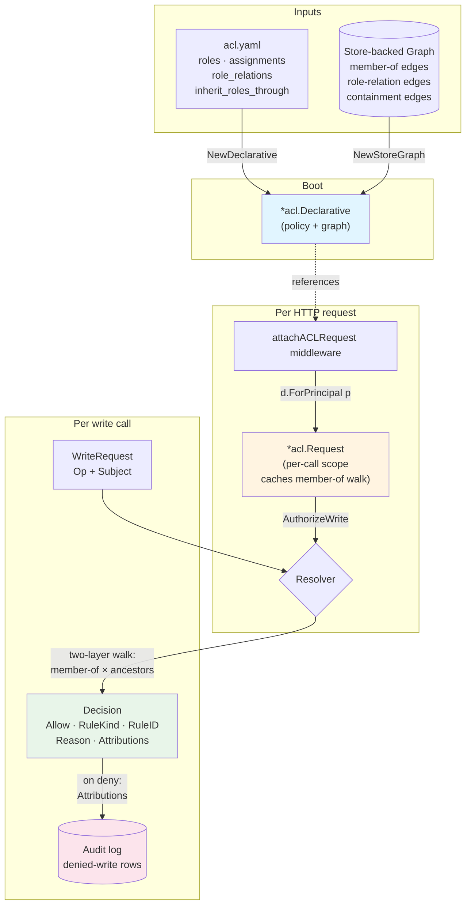
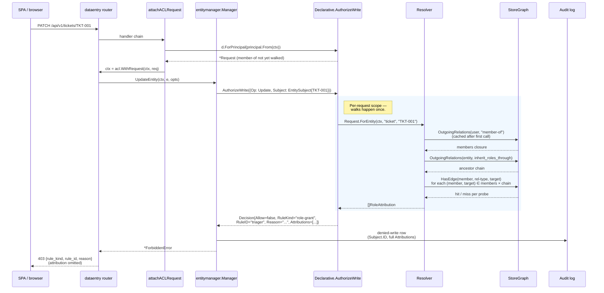

<!-- This file is auto-generated from docs-project/entities/. Do not edit directly. -->

# ACL: Authorization Overview

This guide walks through rela's authorization system end-to-end: how
an `acl.yaml` policy plus the graph's `member-of` and
`inherit_roles_through` edges become a per-write Allow/Deny decision
with full role-attribution provenance. Read [CON-authorization]
first for the vocabulary.

## How it fits together

The ACL system is one moving part: a `*acl.Declarative` constructed
from the policy plus a store-backed graph. Every write call moves
through it.



## Write sequence

A single PATCH from the SPA to the data-entry server traces through
the stack like this:



The single `Request` is what makes the per-list response viable: a
list of 50 tickets reuses one member-of walk and one ancestor chain
per ticket, instead of re-walking 50× from scratch.

## A worked acl.yaml

A small example that exercises every layer of the resolver:

```yaml
roles:
  everyone:
    read: ["*"]
  reader:
    read: [ticket, feature]
  editor:
    read: [ticket, feature]
    write: [ticket]
  triager:
    read: [ticket]
    fields:
      ticket:
        - field: status
          when: "true"

assignments:
  alice: editor              # global grant
  triage-team: triager       # group grant; principals member-of triage-team inherit

role_relations:
  editor-of:                 # an edge of this type confers a role
    confers: editor

inherit_roles_through:
  - belongs-to               # walk these ancestry edges when resolving local roles
```

Given the graph:

```text
alice ──member-of──▶ triage-team
bob ──member-of──▶ triage-team
bob ──editor-of──▶ PROJ-42
PROJ-42 ◀──belongs-to── TKT-001
```

The resolver's decisions:

- **Alice on TKT-001 / Update:** `Allow`. Attributions:
  `(editor, Global)`, `(triager, Group{triage-team})`,
  `(everyone, Global)`. `editor.write` includes `ticket` → allowed.
- **Bob on TKT-001 / Update:** `Allow`. Attributions:
  `(triager, Group{triage-team})`,
  `(editor, LocalViaAncestor{ancestor=PROJ-42, relation=editor-of})`,
  `(everyone, Global)`. `editor` came in via the `editor-of` edge
  to PROJ-42 plus the `belongs-to` inheritance from TKT-001.
- **A drive-by anonymous request:** `Deny`. `ErrUnstampedPrincipal`
  surfaces; the request never reaches `AuthorizeWrite`.

## How to read a deny

A `403` from a write looks like this on the wire:

```json
{
  "error": "forbidden: role 'reader' does not grant write on 'ticket'",
  "rule_kind": "role-grant",
  "rule_id": "reader"
}
```

The wire body is **deliberately terse**: it names the rule that fired
but not the attribution chain — leaking that would tell an attacker
how the principal-to-role topology is structured. The same denial in
the audit log carries the full attribution set:

```text
ts=... user=alice tool=data-entry op=update id=TKT-001
  outcome=denied rule_kind=role-grant rule_id=reader
  attribution="(reader, Global), (everyone, Global)"
```

So an operator investigating "why was alice denied?" reads the audit
log, sees the role set the resolver considered, and can fix either
the policy (give alice editor) or the graph (add alice to a group
that has it).

## Where to read next

- [GUIDE-acl-security] — hardening notes for operators: member-of
  trust boundary, why nil Subject panics, why malformed `acl.yaml`
  fails boot.
- [CON-authorization] — the underlying concept and vocabulary.
