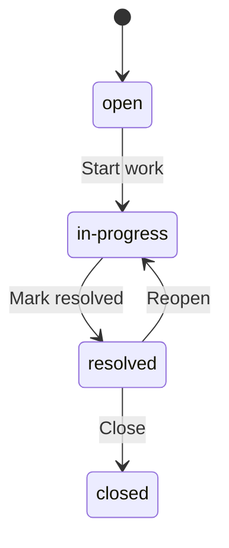
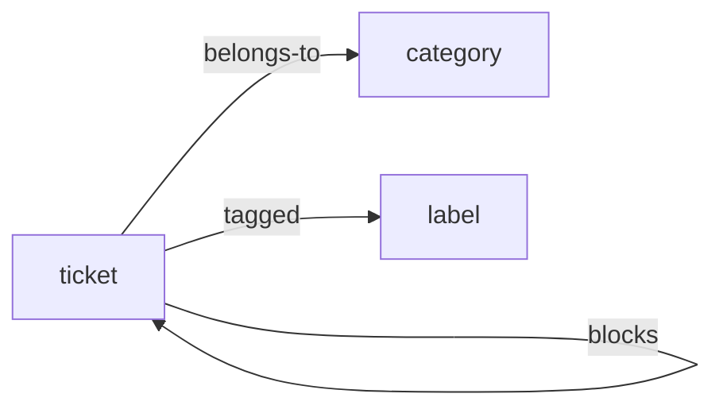
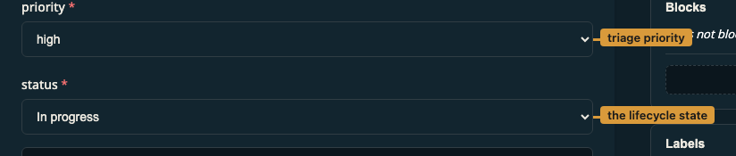

# Ticket tracker — operator handbook

A lightweight ticket tracker: capture work as tickets, group them into
categories, tag and cross-link them, and move each ticket through a simple
lifecycle from open to closed. This description, the per-status explanations,
and the transition help below are surfaced by the generated documentation
(`rela docs`).

This handbook is authored in Markdown; the tables, diagrams, and screenshot
below are resolved from the project's `schema.yaml` and `acl.yaml` by
`rela-docs build`, so they can never drift from the schema. It doubles as a
worked example of the rela-docs generator — see
[the guide](../rela-docs.md).

## Tickets

A **ticket** records a piece of work. Every ticket carries these fields:

| Field | Type | Required |
|---|---|---|
| `title` | string | yes |
| `status` | ticket_status | yes |
| `priority` | priority | yes |
| `reporter` | string | yes |

### Status

A ticket moves through the lifecycle below.

Each status means:

| Value | Meaning |
|---|---|
| `open` _(default)_ | A newly filed ticket that no one has started yet. |
| In progress (`in-progress`) | Someone is actively working on the ticket. |
| `resolved` | The work is done and awaiting confirmation before it is closed. |
| `closed` | The ticket is finished; no further work is expected. |

### How a ticket connects to the rest of the tracker

- `belongs-to` → category
- `blocks` → ticket
- `tagged` → label

The schema neighbourhood, two hops out:

## A worked example

**ticket-1**

- title: Login page 500s under load
- status: in-progress

There is 1 seeded ticket in this example.

> **✓ Verified** — `ticket` resolves to **ticket-1**.

## Who can do what

The access model comes straight from `acl.yaml`:

| Type | Verb | editor | viewer |
|---|---|---|---|
| `ticket` | create | ✓ |  |
| `ticket` | read | ✓ | ✓ |
| `ticket` | update | ✓ |  |
| `ticket` | delete | ✓ |  |

The table above is rendered from `acl.yaml`. Every cell in it is also _checked_
against the real authorization path when this handbook builds, so the prose
cannot outlive the policy it describes.

Those checks carry `emit = false`: the table has already shown the reader what
the policy says, and restating each row underneath it would say the same thing
twice. The claims still run — widen `viewer` in `acl.yaml` and this handbook
stops building.

## The edit form

This is the ticket edit form as an editor sees it, with the two lifecycle-driving
fields highlighted:

